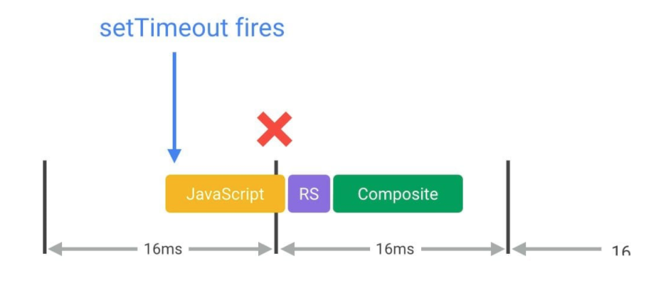

###### Web Runtime/Rendering Performance

###### Overview

- 60 FPS and Device Refresh Rates
- The Pixel Pipeline


###### 60fps and Device Refresh Rates
Most devices today refresh their screens __60 times a second__. Each of those frames has a budget of just over 16ms (1 second / 60 = _16.66ms_). However, the browser has housekeeping work to do, so all of our work needs to be completed inside _10ms_. When you fail to meet this budget the frame rate drops.


###### The Pixel Pipeline
There are five areas we need to mindful when we work. They are ahead we have the most control over and keys points in the pixels-to-screen pipeline:


__JavaScript__: Is used to handle work that will result in visual changes.

__Style calculations__: Is the process of figuring out which CSS rules apply to which elements based on matching selectors. Once rules are known, they are applied and the final styles for each element are calculated.

__Layout/Reflow__: Once the browser knows which rules apply to an element it can begin to calculate how much space it takes up and where it is on screen.

__Paint__: Is the process of filling in pixels. It involves drawing out text, colors, images, borders and shadows and essentially every visual part of the elements. The drawing is typically done onto multiple surfaces, often called layers.

__Compositing__: Since the parts of the page were drawn into potentially multiple layers they need to be drawn to the screen in the correct order so that the page renders correctly.


_We won’t always touch every part of the pipeline on every frame._

- __JS / CSS > Style > Layout > Paint > Composite__
If we change only a `layout` property, like width, height, or position (top, left). Browser has to check all the other elements and `reflow` the page, any affected areas will need to be repainted and the final painted elements will need to be composited back together.

- __JS / CSS > Style > Paint > Composite__
if we change `paint only` property, like, background image, text color or shadows, which does not affect the layout of the page then the browser skips layout but will do the pain.

- __JS / CSS > Style > Composite__
If you change a property that requires neither layout nor paint, and the browser jumps to just do compositing.

We can check all css properties from the following site: 
> https://csstriggers.com/

###### Optimizing JavaScript Execution
- Avoid setTimeout or setInterval for visual updates; always use `requestAnimationFrame` instead.

> Frameworks or samples may use setTimeout or setInterval to do visual changes like animations, but the problem with this is that the callback will run at some point in the frame, possibly right at the end, and that can often have the effect of causing us to miss a frame, resulting in jank. The only way to guarantee that your JavaScript will run at the start of a frame is to use requestAnimationFrame.




- Move long-running JavaScript off the main thread to `Web Workers`. 

> JavaScript runs on the browser’s main thread, right alongside style calculations, layout, and, in many cases, paint. If your JavaScript runs for a long time, it will block these other tasks, potentially causing frames to be missed.


###### Reduce the Scope and Complexity of Style Calculations

__Computed Style Calculation__: The process of changing the DOM through adding and removing elements, changing attributes, classes or animations will cause the browser to recalculate element styles and layout/reflow the page or parts of it.

> The first part of computing styles is to create a set of matching selectors, which is essentially the browser figuring out which classes, pseudo-selectors and IDs apply to any given element.

> The second part of the process involves taking all the style rules from the matching selectors and figuring out what final styles the element has. In Blink (Chrome and Opera's rendering engine) these processes are, today at least, roughly equivalent in cost.

- Reduce the complexity of your selectors

```css
/* Bad */
.box:nth-last-child(-n+1) .title {  
  /* styles */
}

/* Good */
.final-box-title {
  /* styles */
}
```

** _use a class-centric methodology like __BEM (Block, Element, Modifier)___


- Reduce the number of elements on which style calculation must be calculated


###### Avoid Large, Complex Layouts and Layout Thrashing

___Layout__ (Firefox calls it __Reflow__)_ is where the browser figures out the geometric information for elements: their size and location in the page. 

- Avoid layout wherever possible
> Changes to “geometric properties”, such as widths, heights, left, or top all require layout.

- Use flexbox over older layout models
- Avoid forced synchronous layouts

```css
/* Bad */
function logBoxHeight() {
  box.classList.add('super-big');
  /* Gets the height of the box in pixels */
  console.log(box.offsetHeight);}

/* Good */
function logBoxHeight() { 
  /* Gets the height of the box in pixels*/ 
  console.log(box.offsetHeight);
  box.classList.add('super-big');
}
```

- Avoid forced synchronous layouts and layout thrashing; read style values then make style changes.

```js
/* Bad */
function resizeAllParagraphsToMatchBlockWidth() { 
 /* Puts the browser into a read-write-read-write cycle*/
 for (let i = 0; i < paragraphs.length; i++) {    
    paragraphs[i].style.width = box.offsetWidth + 'px';  
  }
}


/* Good */
/* Read */
const width = box.offsetWidth;
function resizeAllParagraphsToMatchBlockWidth() {  
  for (let i = 0; i < paragraphs.length; i++) {
    /* Now write */
    paragraphs[i].style.width = width + 'px'; 
  }
}
```


###### Paint Complexity

- Apart from transforms or opacity, changing any property always triggers paint

- Paint is the most expensive part of the pixel pipeline, we need to avoid where we can.

- If we trigger Layout, it will always trigger Paint, since changing the geometry of any element means its pixels need fixing. We should keep this in mind too.

** There are only two properties for which we can avoid layout and paint, and that only requires compositing changes - ___transforms___ and ___opacity___

###### Debounce Input Handlers
- Avoid long-running input handlers
> We should make sure that any input handlers you run should execute quickly and allow the compositor to do its job. Otherwise, it will block the compositor thread must wait which can result in missing frames.
- Avoid style changes in input handlers
> It will trigger a forced synchronous layout
- Debounce your scroll handlers
> We should always debounce visual changes to the next requestAnimationFrame callback

*Demo:* https://googlechrome.github.io/devtools-samples/jank

###### Resources:

- https://developers.google.com/web/tools/chrome-devtools
- https://developers.google.com/speed/docs/insights/browser-reflow
- https://developers.google.com/web/tools/chrome-devtools/evaluate-performance
- https://developers.google.com/web/fundamentals/performance/rendering
- https://www.html5rocks.com/en/tutorials/speed/high-performance-animations/
- https://aerotwist.com/blog/the-anatomy-of-a-frame/
- https://blog.usejournal.com/what-the-heck-is-repaint-and-reflow-in-the-browser-b2d0fb980c08
- https://gist.github.com/faressoft/36cdd64faae21ed22948b458e6bf04d5
- https://developers.google.com/web/updates/2020


